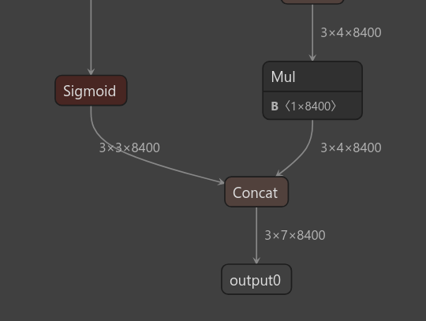
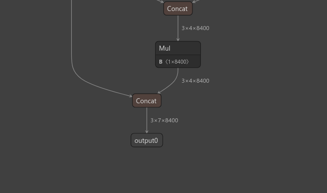

onnx_model_change.py 
remove_sigmoid_and_remap_output()中展示了一段代码用于修改onnx结构：
有一个onnx模型，其输出是由/model.23/Sigmoid层和/model.23/Mul_2被/model.23/Concat_5层拼接而成，去除onnx模型中的sigmod结构进行重新输出。
  
add_fixed_bias_to_onnx() 则能在onnx模型中添加一个add层，达到一个添加bias的功能。

print_onnx_layer.py
print_onnx_layers()能逐层打印onnx模型的结构。
print_onnx_constant()能打印出指定名称的常量/权重数据。