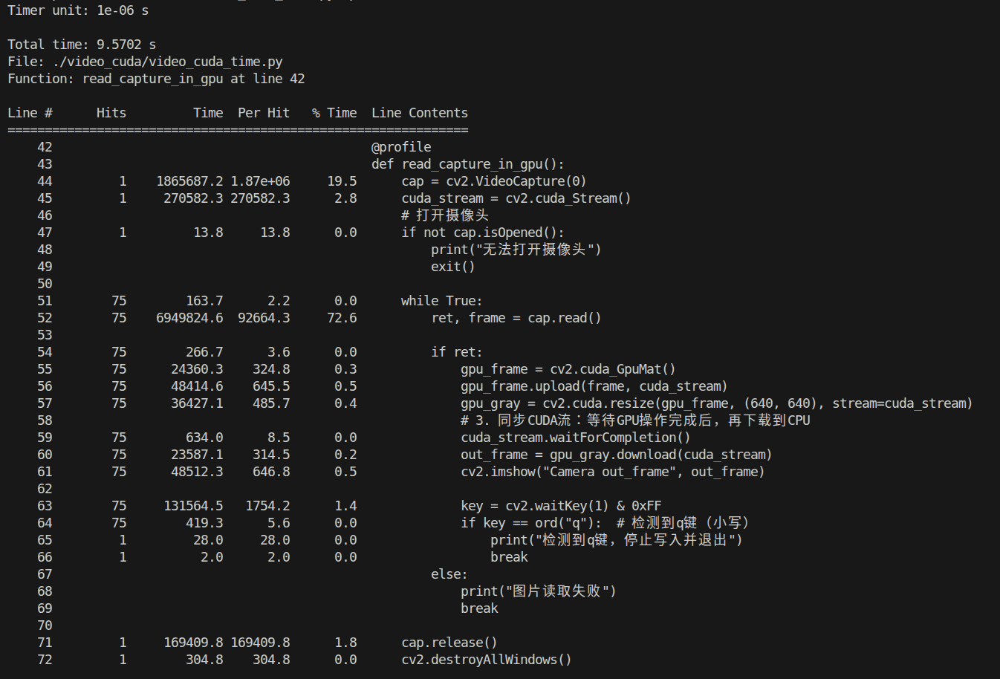

# 通过pip install line_profiler安装line_profiler工具。

使用方式：
    在需要测量的函数前加上装饰器@profile，然后通过kernprof -lv ***.py在命令行运行。
    代码中会显示"profile" is not defined，但不影响使用。
    正常使用代码时需要将@profile注释掉。

测试时有使用到opencv的cuda算子，使用时需要使用从源码安装的opencv，而不是使用pip安装的方式。
安装方法(ubuntu22.04,cuda12.9,opencv4.12.0)
先激活虚拟环境：
conda activate *******

# 更新系统源并安装核心依赖（适配 Ubuntu 22.04）
sudo apt update && sudo apt install -y \
    build-essential cmake git \
    libgtk2.0-dev libavcodec-dev libavformat-dev libswscale-dev \
    libtbb2 libtbb-dev libjpeg-dev libpng-dev libtiff-dev \
    libgstreamer-plugins-base1.0-dev libgstreamer1.0-dev \
    libv4l-dev libxvidcore-dev libx264-dev libatlas-base-dev gfortran \
    libdc1394-dev  # 替换老旧的 libdc1394-22-dev，移除找不到的 libjasper-dev

# 安装虚拟环境内的 Python 依赖（必须）
pip install numpy pillow pycuda

# 检查 CUDA 版本（需输出 12.9）
nvcc -V
# 配置 CUDA 环境变量
export CUDA_HOME=/usr/local/cuda-12.9
export LD_LIBRARY_PATH=$CUDA_HOME/lib64:$LD_LIBRARY_PATH
# 验证 CUDA 路径
echo $CUDA_HOME  # 应输出 /usr/local/cuda-12.9

# 在安装路径下创建编译目录（避免污染系统）
mkdir -p ~/opencv_4.12_build && cd ~/opencv_4.12_build

# 克隆 OpenCV 4.12.0 主源码（指定 tag，精准对应版本）
git clone --depth 1 --branch 4.12.0 https://github.com/opencv/opencv.git

# 克隆 OpenCV_contrib 4.12.0（必须同版本，否则编译报错）
git clone --depth 1 --branch 4.12.0 https://github.com/opencv/opencv_contrib.git

编译opencv的关键
# 进入 OpenCV 编译目录
cd opencv && mkdir build && cd build

# 自动获取虚拟环境的 Python 路径（无需手动修改）
PYTHON_EXEC=$(which python)  # 虚拟环境的 Python 解释器
PYTHON_INCLUDE=$(python -c "from sysconfig import get_paths; print(get_paths()['include'])")  # Python 头文件
PYTHON_LIB=$(python -c "import sys; print(f'{sys.prefix}/lib/libpython{sys.version_info.major}.{sys.version_info.minor}.so')")  # Python 库
PYTHON_PACKAGES=$(python -c "from distutils.sysconfig import get_python_lib; print(get_python_lib())")  # site-packages 路径

# 执行 CMake 配置（复制整段执行，无需拆分）
cmake -D CMAKE_BUILD_TYPE=RELEASE \
      -D CMAKE_INSTALL_PREFIX=$CONDA_PREFIX \
      -D OPENCV_EXTRA_MODULES_PATH=/home/hc/opencv_4.12_build/opencv_contrib/modules \
      -D WITH_CUDA=ON \
      -D CUDA_ARCH_BIN=8.6 \
      -D CUDA_ARCH_PTX="" \
      -D CUDA_TOOLKIT_ROOT_DIR=$CUDA_HOME \
      -D WITH_CUDNN=ON \
      -D OPENCV_DNN_CUDA=ON \
      -D ENABLE_FAST_MATH=ON \
      -D CUDA_FAST_MATH=ON \
      -D BUILD_opencv_python2=OFF \
      -D BUILD_opencv_python3=ON \
      -D PYTHON3_EXECUTABLE=$PYTHON_EXEC \
      -D PYTHON3_INCLUDE_DIR=$PYTHON_INCLUDE \
      -D PYTHON3_LIBRARY=$PYTHON_LIB \
      -D PYTHON3_PACKAGES_PATH=$PYTHON_PACKAGES \
      -D BUILD_EXAMPLES=OFF \
      -D BUILD_TESTS=OFF \
      -D BUILD_PERF_TESTS=OFF \
      -D INSTALL_PYTHON_EXAMPLES=OFF \
      -D WITH_IPP=OFF \
      -D OPENCV_FACE_SKIP_MODELS=ON \
      ..
OPENCV_EXTRA_MODULES_PATH指向opencv-conrib路径
CUDA_ARCH_BIN为显卡的计算能力，可以从https://developer.nvidia.com/cuda/gpus查询
WITH_CUDNN=ON  开启 CUDNN 加速
OPENCV_DNN_CUDA=ON  开启 DNN 模块 CUDA 加速

下载IPPIC缓慢-- 使用wget下载终端中出现的链接
下载后在 opencv-x.x.x\3rdparty\ippicv\ippicv.cmake 这里找到第 47 行的"https://raw.githubusercontent.com/opencv/opencv_3rdparty/${IPPICV_COMMIT}/ippicv/"
修改为/your_path/ippicv_2022.1.0_lnx_intel64_20250130_general.tgz.1
如果你的计算平台不是Intel处理器，就不需要这个模块。可禁用 IPPICV（牺牲少量性能，不影响 CUDA 核心功能），在 CMake 命令中添加 -D WITH_IPP=OFF：

cmake完成后
# 编译（-j 后接 CPU 核心数，R9000P 建议 -j12，加快编译）
make -j$(nproc)

# 安装到虚拟环境（无需 sudo！虚拟环境路径属当前用户）
make install

# 确保仍在虚拟环境中
conda activate tensorrt_cu129

# 1. 检查 OpenCV 路径（必须指向虚拟环境）
python -c "import cv2; print('OpenCV 安装路径：', cv2.__file__)"
# 正常输出示例：/home/hc/miniforge3/envs/tensorrt_cu129/lib/python3.11/site-packages/cv2/__init__.py

# 2. 检查 OpenCV 版本（必须是 4.12.0）
python -c "import cv2; print('OpenCV 版本：', cv2.__version__)"
# 正常输出：4.12.0

# 3. 检查 CUDA 支持（核心！输出 >0 则生效）
python -c "import cv2; print('CUDA 设备数：', cv2.cuda.getCudaEnabledDeviceCount())"
# 正常输出：1（对应你的独显）

read_capture_in_cpu/gpu()的测试结果, 但是从结果来看耗时没有明显区别

